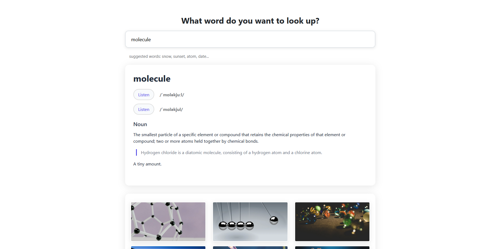
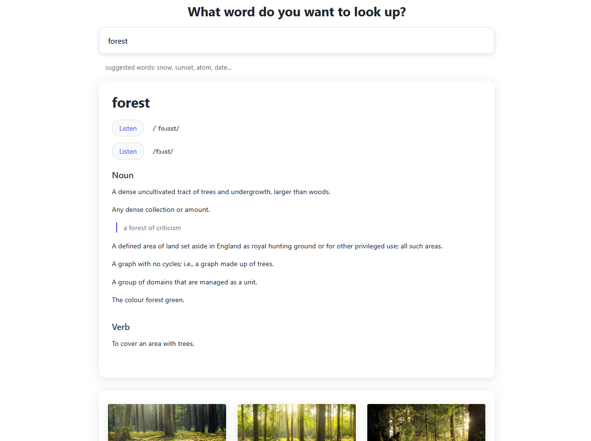
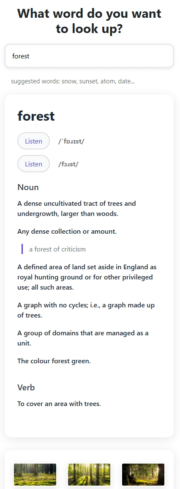

# Dictionary App (React)

A clean and fast English dictionary built with React, focusing on simplicity, clarity, and smooth user experience.

🔗 **Live Demo:** https://react-dictionary-webapp.netlify.app/

## ✨ Features
- 🔤 Search for any English word
- 📚 Definitions, phonetics & example sentences (if available)
- 🔊 Audio pronunciation
- 📱 Fully responsive layout
- ⚡ Fast loading & minimalistic UI

## 🧰 Tech Stack
- React
- JavaScript (ES6+)
- Fetch API / Axios
- CSS
- Dictionary API

## 🧩 Component Structure
- `App` — main application wrapper
- `SearchBar` — input handling + submission
- `Results` — definitions, phonetics, examples, images
- `AudioPlayer` — play pronunciation

## 🧠 What I Learned
- Working with async API requests in React
- Structuring reusable components
- Managing UI states (loading / success / error)
- Handling incomplete or missing API data
- Improving the user experience with audio and formatting

## 🚀 Future Improvements
- ⭐ Add Favorites / Bookmarks (LocalStorage)
- 🌙 Add Light/Dark Theme toggle
- 🔍 Autocomplete suggestions while typing
- 📝 Recent search history
- 💬 Synonyms & related words
- 🌍 Multi-language support (EN → DE → FR)

## 🛠️ Run locally
```
npm install
npm start
```

Uses the free Dictionary API to fetch definitions and phonetics.


## 📸 Screenshots

### 🖥️ Main Search Screen


### 🔎 Full Search Results


### 📱 Mobile View


## 🌟 Highlights
- Clean React component architecture
- Lightweight and fast
- Beginner-friendly code structure

